# Attention

## 30+种 注意力机制

- [Attention Series](#attention-series)
    - [1. External Attention Usage](#1-external-attention-usage)

    - [2. Self Attention Usage](#2-self-attention-usage)

    - [3. Simplified Self Attention Usage](#3-simplified-self-attention-usage)

    - [4. Squeeze-and-Excitation Attention Usage](#4-squeeze-and-excitation-attention-usage)

    - [5. SK Attention Usage](#5-sk-attention-usage)

    - [6. CBAM Attention Usage](#6-cbam-attention-usage)

    - [7. BAM Attention Usage](#7-bam-attention-usage)
    
    - [8. ECA Attention Usage](#8-eca-attention-usage)

    - [9. DANet Attention Usage](#9-danet-attention-usage)

    - [10. Pyramid Split Attention (PSA) Usage](#10-Pyramid-Split-Attention-Usage)

    - [11. Efficient Multi-Head Self-Attention(EMSA) Usage](#11-Efficient-Multi-Head-Self-Attention-Usage)

    - [12. Shuffle Attention Usage](#12-Shuffle-Attention-Usage)
    
    - [13. MUSE Attention Usage](#13-MUSE-Attention-Usage)
  
    - [14. SGE Attention Usage](#14-SGE-Attention-Usage)

    - [15. A2 Attention Usage](#15-A2-Attention-Usage)

    - [16. AFT Attention Usage](#16-AFT-Attention-Usage)

    - [17. Outlook Attention Usage](#17-Outlook-Attention-Usage)

    - [18. ViP Attention Usage](#18-ViP-Attention-Usage)

    - [19. CoAtNet Attention Usage](#19-CoAtNet-Attention-Usage)

    - [20. HaloNet Attention Usage](#20-HaloNet-Attention-Usage)

    - [21. Polarized Self-Attention Usage](#21-Polarized-Self-Attention-Usage)

    - [22. CoTAttention Usage](#22-CoTAttention-Usage)

    - [23. Residual Attention Usage](#23-Residual-Attention-Usage)
  
    - [24. S2 Attention Usage](#24-S2-Attention-Usage)

    - [25. GFNet Attention Usage](#25-GFNet-Attention-Usage)

    - [26. Triplet Attention Usage](#26-TripletAttention-Usage)

    - [27. Coordinate Attention Usage](#27-Coordinate-Attention-Usage)

    - [28. MobileViT Attention Usage](#28-MobileViT-Attention-Usage)

    - [29. ParNet Attention Usage](#29-ParNet-Attention-Usage)

    - [30. UFO Attention Usage](#30-UFO-Attention-Usage)
  
    - [31. MobileViTv2 Attention Usage](#31-MobileViTv2-Attention-Usage)
  

- [Backbone Series](#Backbone-series)

    - [1. ResNet Usage](#1-ResNet-Usage)

    - [2. ResNeXt Usage](#2-ResNeXt-Usage)

    - [3. MobileViT Usage](#3-MobileViT-Usage)

    - [4. ConvMixer Usage](#4-ConvMixer-Usage)

- [MLP Series](#mlp-series)

    - [1. RepMLP Usage](#1-RepMLP-Usage)

    - [2. MLP-Mixer Usage](#2-MLP-Mixer-Usage)

    - [3. ResMLP Usage](#3-ResMLP-Usage)

    - [4. gMLP Usage](#4-gMLP-Usage)

    - [5. sMLP Usage](#5-sMLP-Usage)

- [Re-Parameter(ReP) Series](#Re-Parameter-series)

    - [1. RepVGG Usage](#1-RepVGG-Usage)

    - [2. ACNet Usage](#2-ACNet-Usage)

    - [3. Diverse Branch Block(DDB) Usage](#3-Diverse-Branch-Block-Usage)

- [Convolution Series](#Convolution-series)

    - [1. Depthwise Separable Convolution Usage](#1-Depthwise-Separable-Convolution-Usage)

    - [2. MBConv Usage](#2-MBConv-Usage)

    - [3. Involution Usage](#3-Involution-Usage)

    - [4. DynamicConv Usage](#4-DynamicConv-Usage)

    - [5. CondConv Usage](#5-CondConv-Usage)

***

# Attention Series

- Pytorch implementation of ["Beyond Self-attention: External Attention using Two Linear Layers for Visual Tasks---arXiv 2021.05.05"](https://arxiv.org/abs/2105.02358)

- Pytorch implementation of ["Attention Is All You Need---NIPS2017"](https://arxiv.org/pdf/1706.03762.pdf)

- Pytorch implementation of ["Squeeze-and-Excitation Networks---CVPR2018"](https://arxiv.org/abs/1709.01507)

- Pytorch implementation of ["Selective Kernel Networks---CVPR2019"](https://arxiv.org/pdf/1903.06586.pdf)

- Pytorch implementation of ["CBAM: Convolutional Block Attention Module---ECCV2018"](https://openaccess.thecvf.com/content_ECCV_2018/papers/Sanghyun_Woo_Convolutional_Block_Attention_ECCV_2018_paper.pdf)

- Pytorch implementation of ["BAM: Bottleneck Attention Module---BMCV2018"](https://arxiv.org/pdf/1807.06514.pdf)

- Pytorch implementation of ["ECA-Net: Efficient Channel Attention for Deep Convolutional Neural Networks---CVPR2020"](https://arxiv.org/pdf/1910.03151.pdf)

- Pytorch implementation of ["Dual Attention Network for Scene Segmentation---CVPR2019"](https://arxiv.org/pdf/1809.02983.pdf)

- Pytorch implementation of ["EPSANet: An Efficient Pyramid Split Attention Block on Convolutional Neural Network---arXiv 2021.05.30"](https://arxiv.org/pdf/2105.14447.pdf)

- Pytorch implementation of ["ResT: An Efficient Transformer for Visual Recognition---arXiv 2021.05.28"](https://arxiv.org/abs/2105.13677)

- Pytorch implementation of ["SA-NET: SHUFFLE ATTENTION FOR DEEP CONVOLUTIONAL NEURAL NETWORKS---ICASSP 2021"](https://arxiv.org/pdf/2102.00240.pdf)

- Pytorch implementation of ["MUSE: Parallel Multi-Scale Attention for Sequence to Sequence Learning---arXiv 2019.11.17"](https://arxiv.org/abs/1911.09483)

- Pytorch implementation of ["Spatial Group-wise Enhance: Improving Semantic Feature Learning in Convolutional Networks---arXiv 2019.05.23"](https://arxiv.org/pdf/1905.09646.pdf)

- Pytorch implementation of ["A2-Nets: Double Attention Networks---NIPS2018"](https://arxiv.org/pdf/1810.11579.pdf)

- Pytorch implementation of ["An Attention Free Transformer---ICLR2021 (Apple New Work)"](https://arxiv.org/pdf/2105.14103v1.pdf)

- Pytorch implementation of [VOLO: Vision Outlooker for Visual Recognition---arXiv 2021.06.24"](https://arxiv.org/abs/2106.13112) 
  [【论文解析】](https://zhuanlan.zhihu.com/p/385561050)

- Pytorch implementation of [Vision Permutator: A Permutable MLP-Like Architecture for Visual Recognition---arXiv 2021.06.23](https://arxiv.org/abs/2106.12368) 
  [【论文解析】](https://mp.weixin.qq.com/s/5gonUQgBho_m2O54jyXF_Q)

- Pytorch implementation of [CoAtNet: Marrying Convolution and Attention for All Data Sizes---arXiv 2021.06.09](https://arxiv.org/abs/2106.04803) 
  [【论文解析】](https://zhuanlan.zhihu.com/p/385578588)

- Pytorch implementation of [Scaling Local Self-Attention for Parameter Efficient Visual Backbones---CVPR2021 Oral](https://arxiv.org/pdf/2103.12731.pdf)  [【论文解析】](https://zhuanlan.zhihu.com/p/388598744)

- Pytorch implementation of [Polarized Self-Attention: Towards High-quality Pixel-wise Regression---arXiv 2021.07.02](https://arxiv.org/abs/2107.00782)  [【论文解析】](https://zhuanlan.zhihu.com/p/389770482) 

- Pytorch implementation of [Contextual Transformer Networks for Visual Recognition---arXiv 2021.07.26](https://arxiv.org/abs/2107.12292)  [【论文解析】](https://zhuanlan.zhihu.com/p/394795481) 

- Pytorch implementation of [Residual Attention: A Simple but Effective Method for Multi-Label Recognition---ICCV2021](https://arxiv.org/abs/2108.02456) 

- Pytorch implementation of [S²-MLPv2: Improved Spatial-Shift MLP Architecture for Vision---arXiv 2021.08.02](https://arxiv.org/abs/2108.01072) [【论文解析】](https://zhuanlan.zhihu.com/p/397003638) 

- Pytorch implementation of [Global Filter Networks for Image Classification---arXiv 2021.07.01](https://arxiv.org/abs/2107.00645) 

- Pytorch implementation of [Rotate to Attend: Convolutional Triplet Attention Module---WACV 2021](https://arxiv.org/abs/2010.03045) 

- Pytorch implementation of [Coordinate Attention for Efficient Mobile Network Design ---CVPR 2021](https://arxiv.org/abs/2103.02907)

- Pytorch implementation of [MobileViT: Light-weight, General-purpose, and Mobile-friendly Vision Transformer---ArXiv 2021.10.05](https://arxiv.org/abs/2103.02907)

- Pytorch implementation of [Non-deep Networks---ArXiv 2021.10.20](https://arxiv.org/abs/2110.07641)

- Pytorch implementation of [UFO-ViT: High Performance Linear Vision Transformer without Softmax---ArXiv 2021.09.29](https://arxiv.org/abs/2109.14382)

- Pytorch implementation of [Separable Self-attention for Mobile Vision Transformers---ArXiv 2022.06.06](https://arxiv.org/abs/2206.02680)

***

### 1. External Attention Usage
#### 1.1. Paper
["Beyond Self-attention: External Attention using Two Linear Layers for Visual Tasks"](https://arxiv.org/abs/2105.02358)

#### 1.2. Overview

***

### 2. Self Attention Usage
#### 2.1. Paper
["Attention Is All You Need"](https://arxiv.org/pdf/1706.03762.pdf)

#### 1.2. Overview

***

### 3. Simplified Self Attention Usage
#### 3.1. Paper
[None]()

#### 3.2. Overview

***

### 4. Squeeze-and-Excitation Attention Usage
#### 4.1. Paper
["Squeeze-and-Excitation Networks"](https://arxiv.org/abs/1709.01507)

#### 4.2. Overview

***

### 5. SK Attention Usage
#### 5.1. Paper
["Selective Kernel Networks"](https://arxiv.org/pdf/1903.06586.pdf)

#### 5.2. Overview

***

### 6. CBAM Attention Usage
#### 6.1. Paper
["CBAM: Convolutional Block Attention Module"](https://openaccess.thecvf.com/content_ECCV_2018/papers/Sanghyun_Woo_Convolutional_Block_Attention_ECCV_2018_paper.pdf)

#### 6.2. Overview

***

### 7. BAM Attention Usage
#### 7.1. Paper
["BAM: Bottleneck Attention Module"](https://arxiv.org/pdf/1807.06514.pdf)

#### 7.2. Overview

***

### 8. ECA Attention Usage
#### 8.1. Paper
["ECA-Net: Efficient Channel Attention for Deep Convolutional Neural Networks"](https://arxiv.org/pdf/1910.03151.pdf)

#### 8.2. Overview

***

### 9. DANet Attention Usage
#### 9.1. Paper
["Dual Attention Network for Scene Segmentation"](https://arxiv.org/pdf/1809.02983.pdf)

#### 9.2. Overview

***

### 10. Pyramid Split Attention Usage

#### 10.1. Paper
["EPSANet: An Efficient Pyramid Split Attention Block on Convolutional Neural Network"](https://arxiv.org/pdf/2105.14447.pdf)

#### 10.2. Overview

***

### 11. Efficient Multi-Head Self-Attention Usage

#### 11.1. Paper
["ResT: An Efficient Transformer for Visual Recognition"](https://arxiv.org/abs/2105.13677)

#### 11.2. Overview
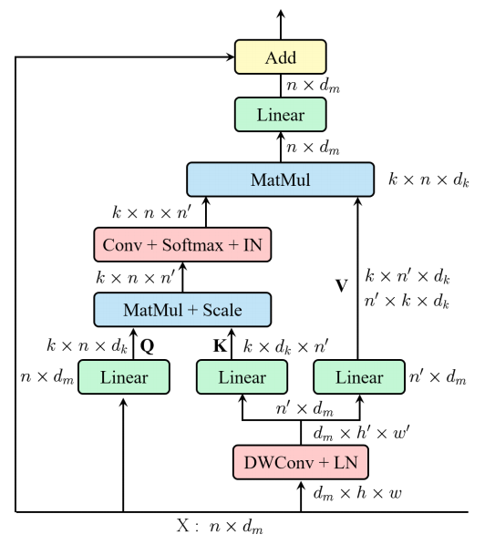

***

### 12. Shuffle Attention Usage

#### 12.1. Paper
["SA-NET: SHUFFLE ATTENTION FOR DEEP CONVOLUTIONAL NEURAL NETWORKS"](https://arxiv.org/pdf/2102.00240.pdf)

#### 12.2. Overview

***

### 13. MUSE Attention Usage

#### 13.1. Paper
["MUSE: Parallel Multi-Scale Attention for Sequence to Sequence Learning"](https://arxiv.org/abs/1911.09483)

#### 13.2. Overview

***

### 14. SGE Attention Usage

#### 14.1. Paper
[Spatial Group-wise Enhance: Improving Semantic Feature Learning in Convolutional Networks](https://arxiv.org/pdf/1905.09646.pdf)

#### 14.2. Overview
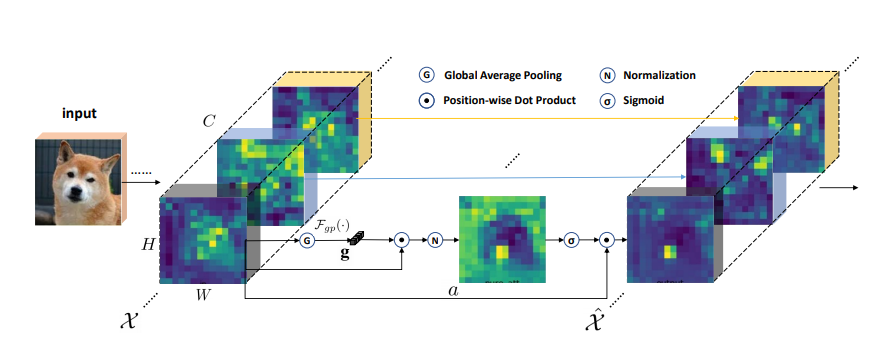

***

### 15. A2 Attention Usage

#### 15.1. Paper
[A2-Nets: Double Attention Networks](https://arxiv.org/pdf/1810.11579.pdf)

#### 15.2. Overview
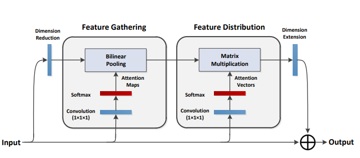

***

### 16. AFT Attention Usage

#### 16.1. Paper
[An Attention Free Transformer](https://arxiv.org/pdf/2105.14103v1.pdf)

#### 16.2. Overview
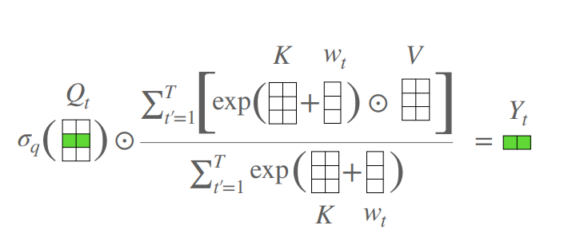

***

### 17. Outlook Attention Usage

#### 17.1. Paper

[VOLO: Vision Outlooker for Visual Recognition"](https://arxiv.org/abs/2106.13112)

#### 17.2. Overview
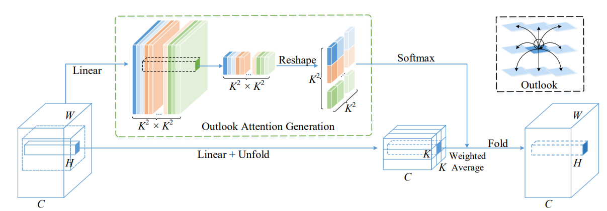

***

### 18. ViP Attention Usage

#### 18.1. Paper

[Vision Permutator: A Permutable MLP-Like Architecture for Visual Recognition"](https://arxiv.org/abs/2106.12368)

#### 18.2. Overview
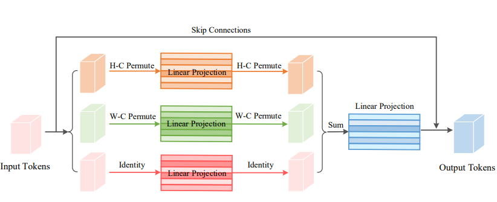

***

### 19. CoAtNet Attention Usage

#### 19.1. Paper

[CoAtNet: Marrying Convolution and Attention for All Data Sizes"](https://arxiv.org/abs/2106.04803) 

#### 19.2. Overview
None

***

### 20. HaloNet Attention Usage

#### 20.1. Paper

[Scaling Local Self-Attention for Parameter Efficient Visual Backbones"](https://arxiv.org/pdf/2103.12731.pdf) 

#### 20.2. Overview

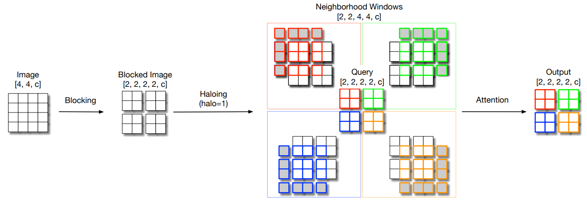

***

### 21. Polarized Self-Attention Usage

#### 21.1. Paper

[Polarized Self-Attention: Towards High-quality Pixel-wise Regression"](https://arxiv.org/abs/2107.00782)  

#### 21.2. Overview

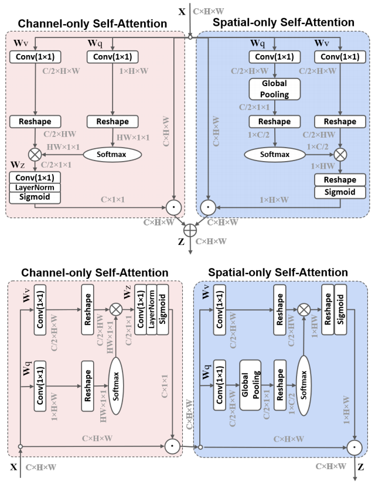

***

### 22. CoTAttention Usage

#### 22.1. Paper

[Contextual Transformer Networks for Visual Recognition---arXiv 2021.07.26](https://arxiv.org/abs/2107.12292) 

#### 22.2. Overview

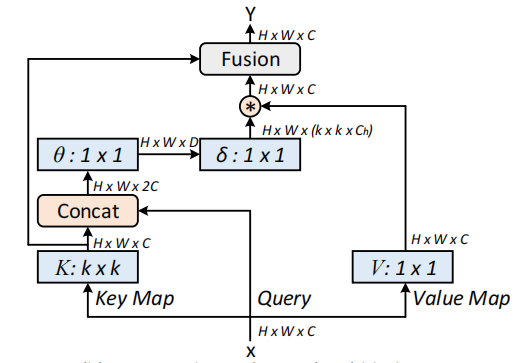

***

### 23. Residual Attention Usage

#### 23.1. Paper

[Residual Attention: A Simple but Effective Method for Multi-Label Recognition---ICCV2021](https://arxiv.org/abs/2108.02456) 

#### 23.2. Overview

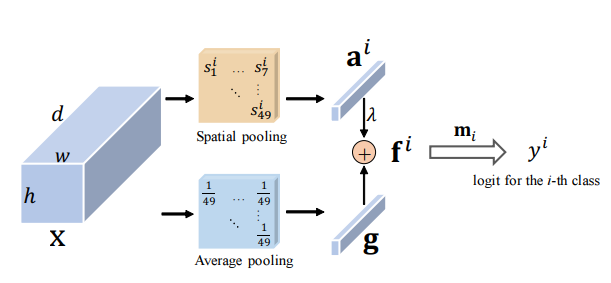

***

### 24. S2 Attention Usage

#### 24.1. Paper

[S²-MLPv2: Improved Spatial-Shift MLP Architecture for Vision---arXiv 2021.08.02](https://arxiv.org/abs/2108.01072) 

#### 24.2. Overview

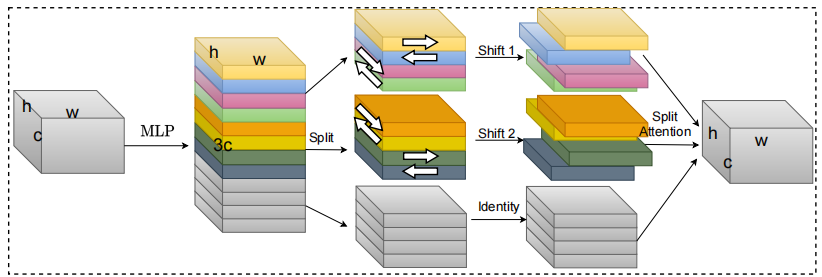

***

### 25. GFNet Attention Usage

#### 25.1. Paper

[Global Filter Networks for Image Classification---arXiv 2021.07.01](https://arxiv.org/abs/2107.00645) 

#### 25.2. Overview

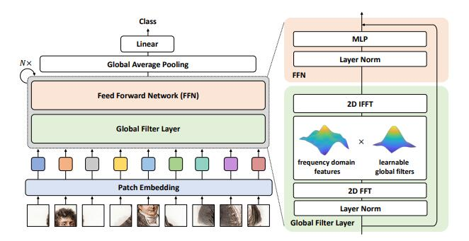

***

### 26. TripletAttention Usage

#### 26.1. Paper

[Rotate to Attend: Convolutional Triplet Attention Module---CVPR 2021](https://arxiv.org/abs/2010.03045) 

#### 26.2. Overview

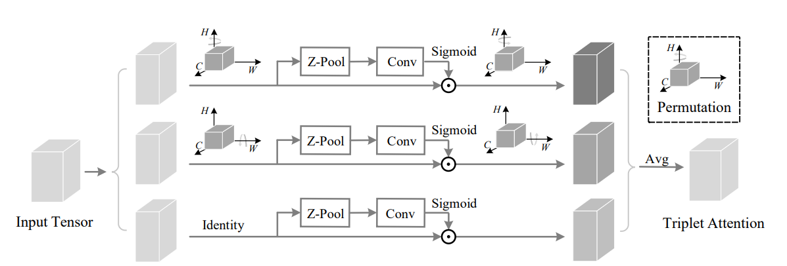

***

### 27. Coordinate Attention Usage

#### 27.1. Paper

[Coordinate Attention for Efficient Mobile Network Design---CVPR 2021](https://arxiv.org/abs/2103.02907)

#### 27.2. Overview

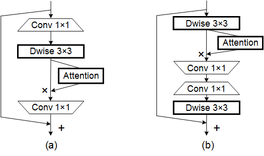

***

### 28. MobileViT Attention Usage

#### 28.1. Paper

[MobileViT: Light-weight, General-purpose, and Mobile-friendly Vision Transformer---ArXiv 2021.10.05](https://arxiv.org/abs/2103.02907)

#### 28.2. Overview

***

### 29. ParNet Attention Usage

#### 29.1. Paper

[Non-deep Networks---ArXiv 2021.10.20](https://arxiv.org/abs/2110.07641)

#### 29.2. Overview

***

### 30. UFO Attention Usage

#### 30.1. Paper

[UFO-ViT: High Performance Linear Vision Transformer without Softmax---ArXiv 2021.09.29](https://arxiv.org/abs/2110.07641)

#### 30.2. Overview

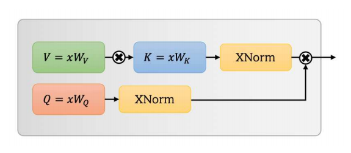

-

### 31. MobileViTv2 Attention Usage

#### 31.1. Paper

[Separable Self-attention for Mobile Vision Transformers---ArXiv 2022.06.06](https://arxiv.org/abs/2206.02680)

#### 31.2. Overview

***

# Backbone Series

- Pytorch implementation of ["Deep Residual Learning for Image Recognition---CVPR2016 Best Paper"](https://arxiv.org/pdf/1512.03385.pdf)

- Pytorch implementation of ["Aggregated Residual Transformations for Deep Neural Networks---CVPR2017"](https://arxiv.org/abs/1611.05431v2)

- Pytorch implementation of [MobileViT: Light-weight, General-purpose, and Mobile-friendly Vision Transformer---ArXiv 2020.10.05](https://arxiv.org/abs/2103.02907)

- Pytorch implementation of [Patches Are All You Need?---ICLR2022 (Under Review)](https://openreview.net/forum?id=TVHS5Y4dNvM)

### 1. ResNet Usage
#### 1.1. Paper
["Deep Residual Learning for Image Recognition---CVPR2016 Best Paper"](https://arxiv.org/pdf/1512.03385.pdf)

#### 1.2. Overview
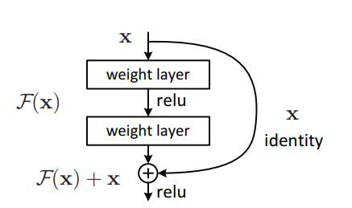
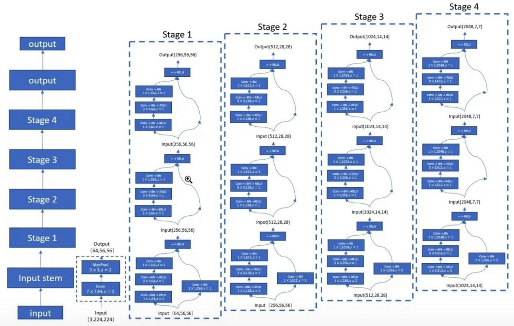

### 2. ResNeXt Usage
#### 2.1. Paper

["Aggregated Residual Transformations for Deep Neural Networks---CVPR2017"](https://arxiv.org/abs/1611.05431v2)

#### 2.2. Overview

### 3. MobileViT Usage
#### 3.1. Paper

[MobileViT: Light-weight, General-purpose, and Mobile-friendly Vision Transformer---ArXiv 2020.10.05](https://arxiv.org/abs/2103.02907)

### 4. ConvMixer Usage
#### 4.1. Paper
[Patches Are All You Need?---ICLR2022 (Under Review)](https://openreview.net/forum?id=TVHS5Y4dNvM)
#### 4.2. Overview

# MLP Series

- Pytorch implementation of ["RepMLP: Re-parameterizing Convolutions into Fully-connected Layers for Image Recognition---arXiv 2021.05.05"](https://arxiv.org/pdf/2105.01883v1.pdf)

- Pytorch implementation of ["MLP-Mixer: An all-MLP Architecture for Vision---arXiv 2021.05.17"](https://arxiv.org/pdf/2105.01601.pdf)

- Pytorch implementation of ["ResMLP: Feedforward networks for image classification with data-efficient training---arXiv 2021.05.07"](https://arxiv.org/pdf/2105.03404.pdf)

- Pytorch implementation of ["Pay Attention to MLPs---arXiv 2021.05.17"](https://arxiv.org/abs/2105.08050)

- Pytorch implementation of ["Sparse MLP for Image Recognition: Is Self-Attention Really Necessary?---arXiv 2021.09.12"](https://arxiv.org/abs/2109.05422)

### 1. RepMLP Usage
#### 1.1. Paper
["RepMLP: Re-parameterizing Convolutions into Fully-connected Layers for Image Recognition"](https://arxiv.org/pdf/2105.01883v1.pdf)

#### 1.2. Overview
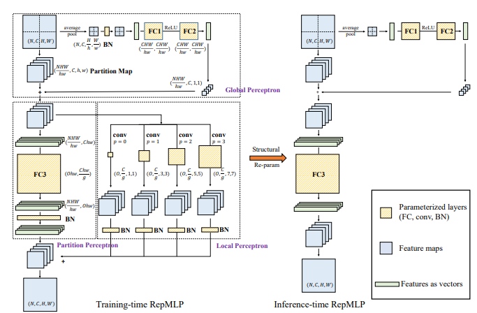

### 2. MLP-Mixer Usage
#### 2.1. Paper
["MLP-Mixer: An all-MLP Architecture for Vision"](https://arxiv.org/pdf/2105.01601.pdf)

#### 2.2. Overview
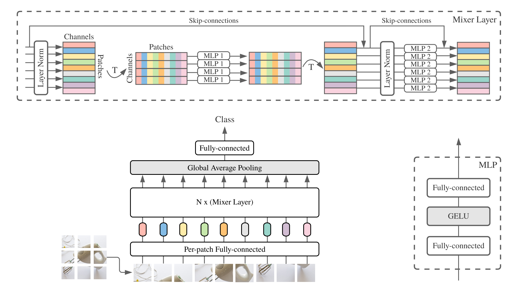

***

### 3. ResMLP Usage
#### 3.1. Paper
["ResMLP: Feedforward networks for image classification with data-efficient training"](https://arxiv.org/pdf/2105.03404.pdf)

#### 3.2. Overview

***

### 4. gMLP Usage
#### 4.1. Paper
["Pay Attention to MLPs"](https://arxiv.org/abs/2105.08050)

#### 4.2. Overview

***

### 5. sMLP Usage
#### 5.1. Paper
["Sparse MLP for Image Recognition: Is Self-Attention Really Necessary?"](https://arxiv.org/abs/2109.05422)

#### 5.2. Overview
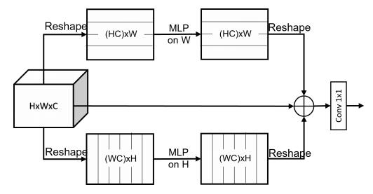

# Re-Parameter Series

- Pytorch implementation of ["RepVGG: Making VGG-style ConvNets Great Again---CVPR2021"](https://arxiv.org/abs/2101.03697)

- Pytorch implementation of ["ACNet: Strengthening the Kernel Skeletons for Powerful CNN via Asymmetric Convolution Blocks---ICCV2019"](https://arxiv.org/abs/1908.03930)

- Pytorch implementation of ["Diverse Branch Block: Building a Convolution as an Inception-like Unit---CVPR2021"](https://arxiv.org/abs/2103.13425)

***

### 1. RepVGG Usage
#### 1.1. Paper
["RepVGG: Making VGG-style ConvNets Great Again"](https://arxiv.org/abs/2101.03697)

#### 1.2. Overview
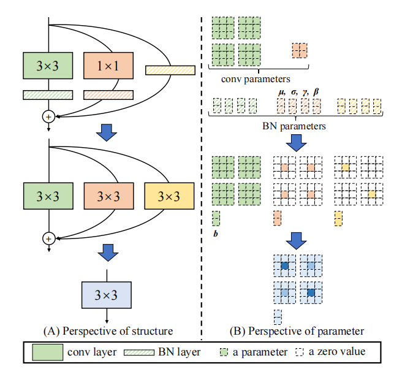

***

### 2. ACNet Usage
#### 2.1. Paper
["ACNet: Strengthening the Kernel Skeletons for Powerful CNN via Asymmetric Convolution Blocks"](https://arxiv.org/abs/1908.03930)

#### 2.2. Overview

***

### 2. Diverse Branch Block Usage
#### 2.1. Paper
["Diverse Branch Block: Building a Convolution as an Inception-like Unit"](https://arxiv.org/abs/2103.13425)

#### 2.2. Overview

# Convolution Series

- Pytorch implementation of ["MobileNets: Efficient Convolutional Neural Networks for Mobile Vision Applications---CVPR2017"](https://arxiv.org/abs/1704.04861)

- Pytorch implementation of ["Efficientnet: Rethinking attention_model scaling for convolutional neural networks---PMLR2019"](http://proceedings.mlr.press/v97/tan19a.html)

- Pytorch implementation of ["Involution: Inverting the Inherence of Convolution for Visual Recognition---CVPR2021"](https://arxiv.org/abs/2103.06255)

- Pytorch implementation of ["Dynamic Convolution: Attention over Convolution Kernels---CVPR2020 Oral"](https://arxiv.org/abs/1912.03458)

- Pytorch implementation of ["CondConv: Conditionally Parameterized Convolutions for Efficient Inference---NeurIPS2019"](https://arxiv.org/abs/1904.04971)

***

### 1. Depthwise Separable Convolution Usage
#### 1.1. Paper
["MobileNets: Efficient Convolutional Neural Networks for Mobile Vision Applications"](https://arxiv.org/abs/1704.04861)

#### 1.2. Overview

***

### 2. MBConv Usage
#### 2.1. Paper
["Efficientnet: Rethinking attention_model scaling for convolutional neural networks"](http://proceedings.mlr.press/v97/tan19a.html)

#### 2.2. Overview

***

### 3. Involution Usage
#### 3.1. Paper
["Involution: Inverting the Inherence of Convolution for Visual Recognition"](https://arxiv.org/abs/2103.06255)

#### 3.2. Overview

***

### 4. DynamicConv Usage
#### 4.1. Paper
["Dynamic Convolution: Attention over Convolution Kernels"](https://arxiv.org/abs/1912.03458)

#### 4.2. Overview

***

### 5. CondConv Usage
#### 5.1. Paper
["CondConv: Conditionally Parameterized Convolutions for Efficient Inference"](https://arxiv.org/abs/1904.04971)

#### 5.2. Overview

## 🎓 Acknowledgement

 <b>Expand</b> 

* [🔗attentionl参考](https://github.com/xmu-xiaoma666/External-Attention-pytorch)

